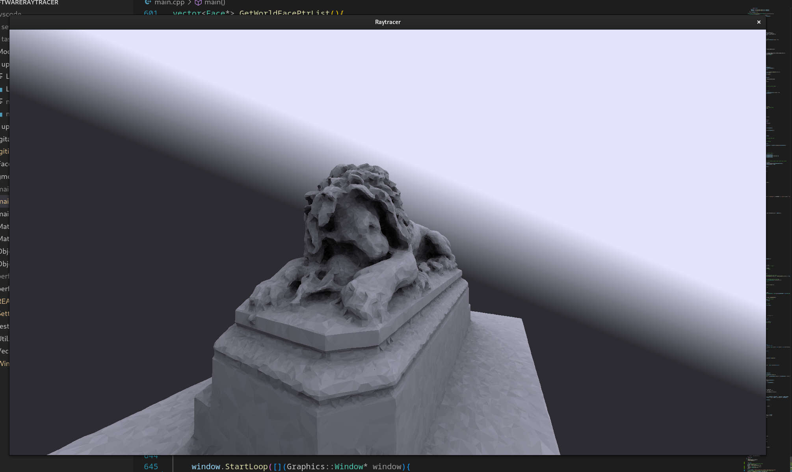
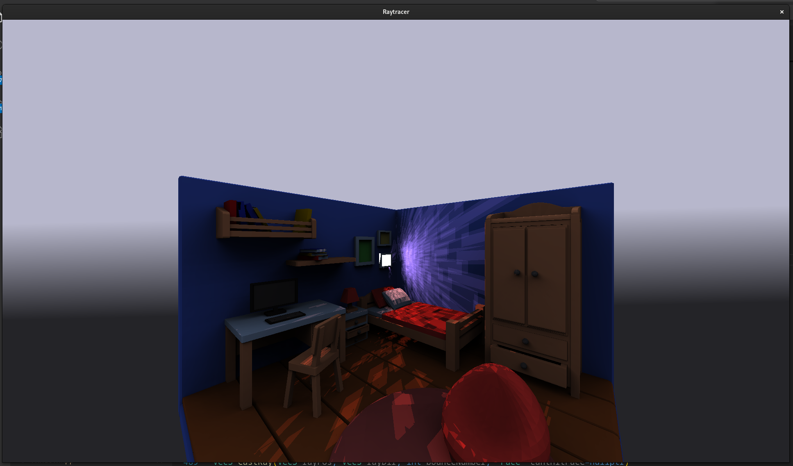

# Software Ray Tracer

## Description

My attempt at writing a ray tracer optimised to run on the CPU only.

### Some of the optimisations implimented
- BVH(bounding volume heirachy) groupes faces so total number of intersection tests are greatly reduced
- Use of fibinacci latice for uniform hemisphere sampling, provides less noise for fewer samples compared to random sampling
- Any two faces which together form either a rectangle or a rhombus are combined so that they can be reprisented by a single face, therefore reducing the total number of faces.

### Screenshots

## Install and Compile
**Important to note that in its current state it can only display graphics on Windows and Linux.
Some modication to the code might be needed to get graphics working depending on your system.**

- On **Linux**: `-lX11`
- On **Windows**: `-luser32 -lgdi32`
`
g++ -g main.cpp -m64 -Ofast -march=native -mtune=native -flto -pipe -ffast-math -funsafe-math-optimizations (libraries for your system)
`

## How to use

Place your .obj model along with any .mtl files in the models folder. Update main in main.cpp to load your file.
Depending on your model changing the settings in Settings.hpp may increase performance. To move the camera in the scene it is wasd, e and q for rotation and v and space for vertical movement. 

## Future improvments

- Importance sampling to reduce noise
- Improoved use of SIMD instructions / other optimization
- Addition of glass and volumentrics
