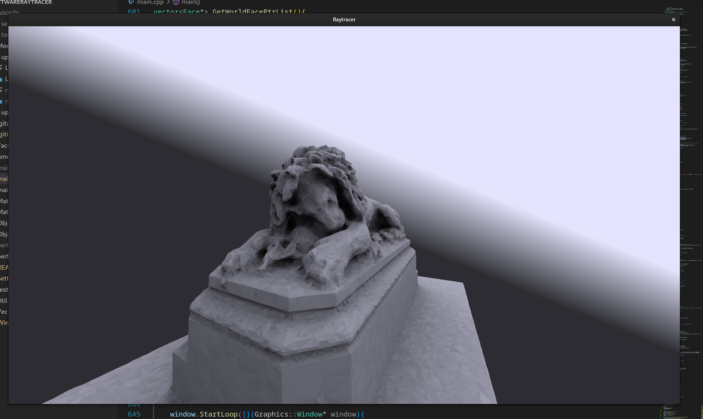
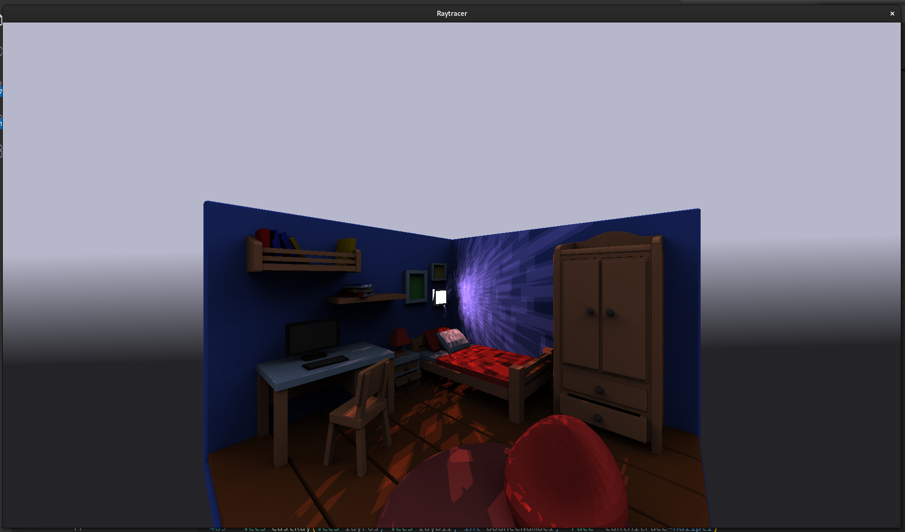
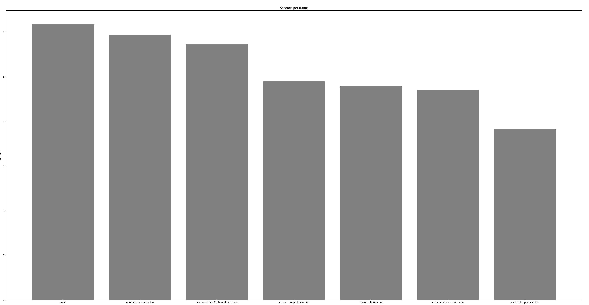

# Software Ray Tracer

## Description

My attempt at writing a ray tracer from scratch optimised to run on the CPU.

I used the book () to aid my understanding of ray tracing.

### Screenshots

## Install and Compile
**Important to note that in its current state it can only display graphics on Windows and Linux.
Some modication to the code might be needed to get graphics working on Mac.**

- On **Linux**: `-lX11`
- On **Windows**: `-luser32 -lgdi32`

`
g++ -g main.cpp -m64 -Ofast -march=native -mtune=native -flto -pipe -ffast-math -funsafe-math-optimizations (libraries for your system)
`

## How to use

Place your .obj model along with any .mtl files in the models folder. Update main in main.cpp to load your file.
Depending on your model changing the settings in Settings.hpp may increase performance. To move the camera in the scene it is wasd, e and q for rotation and v and space for vertical movement. 

## Change log
Covers the main features of each new version.

#### Version 1.0.0
- Utilizes BVH (bounding volume heirachy) to massivly reduce the number of face intersection tests.
- Use of fibinacci latice for uniform sampling, provides less nose for fewer samples compared to random sampling
- Combining triangles into quadralaterals where possible, to reduce the number of faces and improve performance

#### Version 1.0.1
- Support for bmp textures
- Direct light sampling

## Future improvments

- Improved use of SIMD instructions / other optimization
- Addition of glass and volumentrics
